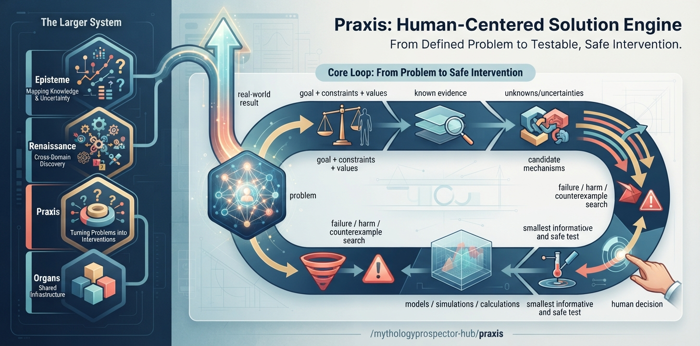

# Praxis

A human-centered solution-discovery engine for turning defined problems into testable, safe interventions.

Praxis is intended to help people move from **a problem worth solving** toward **better options for solving it** without turning people into objects of optimization.

## Role in the larger system

- **Episteme** — understand what is known, unknown, uncertain, contradictory, and testable.
- **Renaissance** — the human-centered foundation and wider constellation that establishes shared purpose, principles, capability boundaries, and explicit ways for independent instruments to cooperate. Its current human-facing aims are to increase humanity's ability to understand, explore, create, learn, and flourish.
- **Praxis** — work from a defined human problem toward candidate interventions, tests, and evidence.
- **Organs** — provide shared runtime infrastructure through explicit contracts when integration is justified.

Praxis does not replace human judgment. It exists to improve the quality of the options and evidence available to human decision-makers.

## Core loop

```
problem
  ↓
goal + constraints + values
  ↓
known evidence
  ↓
unknowns / uncertainties
  ↓
candidate mechanisms
  ↓
candidate interventions
  ↓
failure / harm / counterexample search
  ↓
models / simulations / calculations where justified
  ↓
smallest informative and safe test
  ↓
human decision
  ↓
real-world result
  ↓
evidence
  ↓
Episteme
```

The bounded loop now reaches the explicit human decision gate, records observed results, and returns them to the evidence state only through explicit human evidence admission. Result-to-evidence admission is traceable; observed results are never silently promoted.

## Current status

The foundational domain substrate is established and tested through the major stages of the problem-solving loop.

Current domain objects include:

- **Problem** — a human-defined problem with goals, constraints, values, non-negotiables, stakeholders, risks, and tradeoffs.
- **EvidenceItem / EvidenceState** — evidence-bearing statements with provenance and uncertainty, explicitly associated with a problem.
- **EvidenceGap / ReasoningContext** — material unknowns and the grounded reasoning input that carries evidence and gaps together.
- **Hypothesis / HypothesisEvaluation** — proposed explanations and explicit inferences about them, kept distinct from evidence.
- **Intervention / CandidateSet** — proposed changes and bounded candidate groupings without automatic ranking, selection, authorization, or execution.
- **FailureMode / FailureAnalysis** — explicit failure and harm analysis, with lineage back to the request and underlying failure modes.
- **Model** — a bounded calculation/simulation artifact with purpose, inputs, assumptions, outputs, and uncertainty.
- **Test** — a bounded learning plan with expected observations, safety constraints, reversibility, decision criteria, and lineage to supporting artifacts.
- **Result** — an observed outcome from a test, with provenance, uncertainty, and deviations.
- **Decision / DecisionScope** — a recorded human decision and its bounded relationship to a test or intervention.
- **Derivation / ResultScope** — explicit traceability and experimental scope boundaries.

Explicit request boundaries are also established and tested for candidate generation, hypothesis evaluation, failure analysis, model construction, test design, result capture, evidence admission, and decision formulation.

The corresponding assembly boundaries validate that produced artifacts belong to the requests and problems that claim them, including supplied artifact lineage where applicable. Result-derived evidence requires explicit source-result lineage and a separate human admission boundary.

**What is not yet implemented:** general candidate-generation reasoning, general failure-analysis reasoning, model execution, test execution, automated real-world action, and runtime integration with Organs. The bounded domain workflow and its explicit Praxis→Episteme translation boundary are now tested; direct runtime coupling and broader cross-domain reasoning remain separate future work.

## Integration

Praxis now defines an explicit, runtime-independent handoff packet for admitted evidence to cross into Episteme without changing its identity or authority. See the Episteme handoff boundary in `episteme_handoff.py` and the durable integration notes in `docs/INTEGRATION.md`.


See [docs/INTEGRATION.md](docs/INTEGRATION.md) for the current Organs boundary. Runtime integration is deliberately downstream of stable domain semantics.

## Development

The repository is intended to be understandable from its durable artifacts and tests. Before substantial work, inspect the canon, architecture, roadmap, decisions, and current repository state.

Run the test suite with:

```bash
pytest
```

For the canonical development direction and current implementation status, see:

- [CANON.md](CANON.md)
- [docs/ARCHITECTURE.md](docs/ARCHITECTURE.md)
- [docs/ROADMAP.md](docs/ROADMAP.md)
- [docs/DECISIONS.md](docs/DECISIONS.md)
- [docs/CONTEXT.md](CONTEXT.md)

## Principles

Praxis preserves human agency, epistemic discipline, explicit provenance, failure analysis, bounded experimentation, transparency, and separation between analysis and consequential authority.

See [CANON.md](CANON.md) for the governing principles.
